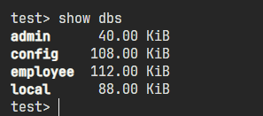

# Commands for MongoDB

## 01. show dbs:

- This command is used for showing all the database that are present in the collection
- Reminding you that database meaning tables and the collection meaning the database according to sql

```bash
    show dbs
```



## 02. Insert Operation

### db.collection_name.insertOne():

- This is used to make one single document which is basically a key value pair like json formatted code

```bash
    db.managers.insertOne(
        {
            "name":"Ahmed",
            "age":"19",
            "role":"Backend-Programer"

        }
    )
```

### db.collection_name.insertMany():

- This is used to make one multiple document which is basically a key value pair like json formatted code with in a collection

```bash
    db.mangagers.insertMany[
        {"name": "Ahmed Yar", "age": 23, "department": "HR"},
        {"name": "Zainab", "age": 18, "department": "ICS"},
        {"name": "Ayaan Hassan Khan", "age": 21, "department": "Computer Science"},
        {"name": "Hamza Sajid", "age": 23, "department": "Backend-Software Testing"},
    ]

```

### db.collection_name.deleteMany({}):

- This command is used for deleting all the documents present in the collections

```bash
    db.manages.deleteMany({})
```

### find():

- This is basically used to retrive all the documents in the collection

```bash
    db.managers.find()
```

### find({identifyer}):

- This is very powerfull because this is used to select something based upon certain contion

```bash
    db.mangers.find ({"name": "Zainab"})
```

- They could also be used for conditional redering meaning the concepts of and or not etc

```json
    db.managers.find({
    	status:{
    			$in:["red","blue"]
    	}
    })
```

- _$in_ reprsent wether "red" or "blue" exits in the status array

### Using "AND" & "OR" operator:

```json
    db.managers.find({
        $and:[
            {department:"ICS"},
            {name:"Ahmed"}
        ]
    })
```

```json
db.managers.find({
    $or:[
        {department:"ICS"},
        {name:"Ahmed"}
    ]
})
```
